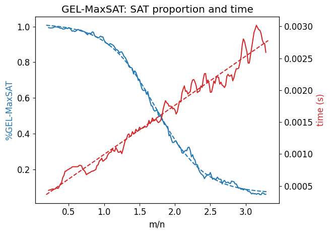

# GEL-MaxSAT
 
> A tractable Graphic EL MaxSAT solver

## Install the dependencies
```bash
pip3 install -r requirements.txt
```

## Usage
The `<inputfile>` will be your OWL file with probabilistic restrictions. 

```bash
python3 gel_max_sat.py <inputfile>
```

## Experiments
The experiments (with the default values) can be made by running
```bash
python3 experiments.py [optional arguments]
```

### Generation of random formulas
The formulas in the experiments are generated randomly. Because every Graphic EL knowledge base can be represented as a directed graph, the problem of generating a random GEL knowledge base can be reduced to the problem of generating a random graph. This process is done as follows.

We have the following fixed values:
- `n`, the number of concepts;
- `m`, the number of axioms (certain and uncertain);
- `p`, the number of uncertain axioms;
- `r`, the number of roles.

First, we start with a graph `G` with zero arrows and three vertices: `⊤` (the *top concept*), `⊥` (the *bottom concept*) and `init` (the artificial initial concept). Then, we add `n` vertices and `r` roles to `G`. After that, we add `m - p` certain arrows and `p` uncertain arrows. The arrows are added by chosing randomly two vertices `C` and `D` (`n + 3` possibilities for each one) and creating an arrow from `C` to `D`, its role is chosen uniformly between an "is a" role (`C ⊑ D`) and the `r` other roles (`C ⊑ ∃ri.D`).  

Note that we do not need to generate body-existential axioms (`∃ri.C ⊑  D`) because they can be represented by simple and existential-head axioms. Also, individual concepts are represented by every concept `C` such that `init ⊑ C`. 

Finally, during and after the insertion of arrows, the graph is completed following the graph completion rules.

### Plotting
The experiments can be plotted by running
```bash
python3 plot.py data/experiments/<experiment>
``` 

### Example
This is the experiment behaviour for the default configuration:



## License
[MIT](https://choosealicense.com/licenses/mit/)